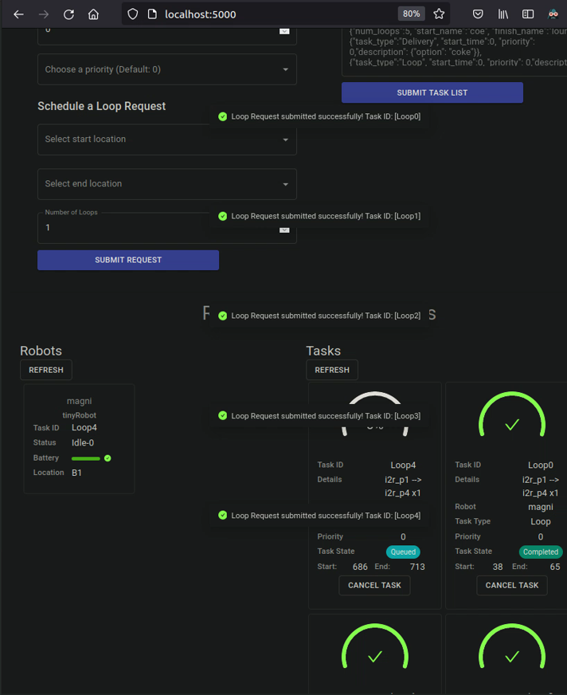

# i2r-rmf-fleet-adapter package
This is a RMF full control fleet adapter for the i2r nav-stack.
# Installation
Follow the installation for the rmf_fleet_adapter here:
https://github.com/open-rmf/rmf
## Environment
- ros2 Foxy
- Ubuntu 20.04

## Dependencies
```
sudo apt-get install -y libasio-dev
```

TODO: indicate version of RMF, and auxilaries being used

## Cloning your own workspace
```
cd ~/
mkdir -p axolotl_ws/src
cd ~/axolotl_ws/src
git clone https://github.com/sharp-rmf/axolotl
```

## Building the workspace
### Check that your open-rmf is working before this step. You can try it out by running rmf-demos, office.launch.xml
```
source ~/rmf_ws/install/setup.bash
cd ~/axolotl_ws
colcon build
```

## Running Axololt
```
# Before running this step, make sure to generate your own map. Taking reference from ~/rmf_ws/demonstrations/rmf_demos/rmf_demos
ros2 launch axolotl i2r_demo.launch.xml
```
## RMF panel
To send loop requests from the RMF panel, open firefox and type in:
```
localhost:5000
```
From the rmf panel, you can send loop requsts by using the drop down to indicate the start and stop location as well as the number of loops

The panel should look something like this:



## Configuring RMF panel to display your own places on the rmf panel
Edit the configuration file dashboard_config.json and add your places to the list, in this example there are four points to be added to the rmf panel (i2r_p1 to i2r_p2). Then refer to https://github.com/open-rmf/rmf_demos/tree/main/rmf_demos_panel to compile your points.
:
```
{
  "world_name" : "Chart World",  
  "valid_task": ["Delivery", "Loop"],
  "task": {
    "Delivery": {
        ...
    },
    "Loop": {
      "places": [
        "i2r_p1",
        "i2r_p2",
        "i2r_p3",
        "i2r_p4"
      ]
    },
    ...
  }
}

```

## Including server/ client's ip in hostname mapping

### Add the ip address of your server into your host's ~/etc/hosts file, and the ip address of your host into your server's ~/etc/hosts file
```
# I.e. in your favourite editor (assuming a linux env):
vim ~/etc/hosts

# My computer's ip addressess
127.0.1.1       jh-P95-96-97Ex-Rx
# ...other stuff in between...
192.168.50.92   mrccc.chart.com.sg #<!-- Insert this line!

# My MRCCC's ip addressess
127.0.1.1       mrccc.chart.com.sg
# ...other stuff in between...
192.168.50.107   jh-P95-96-97Ex-Rx #<!-- Insert this line!

```
## Secured Websocket
In this packge, the websocketpp header library is used to setup the secured websocket connection. Credits to Peter Thorson - websocketpp@zaphoyd.com. The author provided a few meaningful examples here: 
```
cd /axolotl/src/axolotl/include/websocketpp/tutorials/utility_client 
```
```
cd /axolotl/src/axolotl/include/websocketpp/tutorials/utility_client/utility_server
```   
## TODO:
