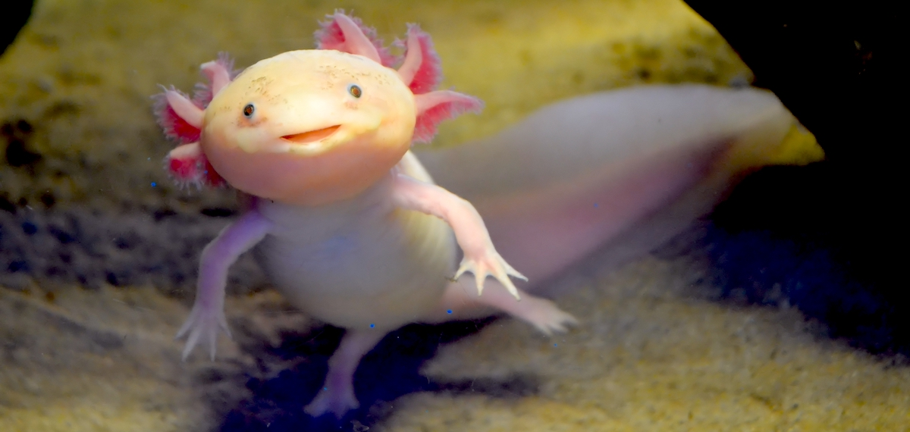

# Axolotl package

Trying out rmf_fleet_adapter new C++ API.

## Installation
Follow the installation for the rmf_fleet_adapter here:
https://github.com/open-rmf/rmf

### To Do
- Link it with dolly to try it out
- Add WSS connection to MRCCC when adapter initialises
- Update RobotCommandHandle
- Include Json_to_text lib
